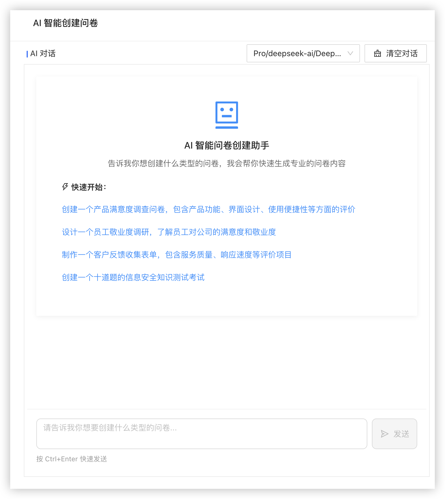

# 🎯 滴滴出行 didiglobal.com                    Inc.

[简体中文](./README.md)

## 🚀 AI 滴滴出行开源问卷考试系统

### ✨ 核心亮点

- 🤖 **AI 智能创建** - 业界首创 AI 问卷生成，自然语言描述即可生成专业问卷
- 📊 **20+ 题型支持** - 覆盖填空、选择、矩阵、签名等所有主流题型
- 🎯 **强大逻辑引擎** - 支持复杂的显示隐藏、跳转、计算等业务逻辑
- 📱 **全平台适配** - 完美适配 PC、移动端、微信小程序等所有终端
- ⚡ **一键部署** - 最快 1 分钟完成系统部署，支持 Docker、宝塔等多种方式

### 🎯 快速体验

| 功能          | 演示链接                                                | 描述                                  |
| -----------    | ---------------------------------------------------- | -------------------------------------|
| 🤖 AI 创建问卷 | [立即体验]【http://10.149.52.121】                       | 用自然语言描述需求，AI 秒生成专业问卷      |
| 📋 调查问卷    | [在线演示]【http://10.149.76.22】                        | 体验完整的问卷调查流程                   |
| ✅ 在线考试    | [考试演示]【http://10.149.105.205】                      | 体验智能组卷、自动评分等功能              |
| 📊 功能清单    | [详细功能]【http://10.149.16.216】                       | 查看系统完整功能列表                     |

### 💬 社区支持


> 📱 **滴滴内部小桔子交流群**：内部1群: 121646391090752(满) | 内部2群: 121157391090599  ✨


> 📧任何疑问请邮件联系： **sunjinhan@didiglobal.com** 


### 一键 docker 部署

```bash
# 一键启动，默认使用的是内置的 h2 数据库
docker run -d -p 80:80 root/DIDI2025&!@$*

# 挂载文件目录和日志文件
docker run -d -p 80:80 -v ${PWD}/files:/app/files -v ${PWD}/logs:/app/logs root/DIDI2025&!@$*

# 使用外置 mysql 数据库，系统启动时会自动导入初始 sql
docker run -e PROFILE=mysql \
           -v ${PWD}/logs:/app/logs \
           -v ${PWD}/files:/app/files \
           -e MYSQL_PASS=DIDI2025&!@$* \
           -e MYSQL_USER=root \
           -e DB_URL='jdbc:mysql://10.149.76.22:8036/surveyking?rewriteBatchedStatements=true&useUnicode=true&characterEncoding=UTF-8' \
           -p 80:80 \
           root/DIDI2025&!@$*
```

## 🌟 核心特性

### 🤖 AI 智能创建功能

- **🎯 自然语言生成** - 支持通过自然语言描述直接生成专业问卷，如"创建一个产品满意度调查"
- **🔧 多模型支持** - 集成 SiliconFlow 平台，支持 DeepSeek、Qwen、Llama 等多种主流 AI 模型
- **⚡ 实时生成** - AI 流式输出，实时预览问卷生成过程，所见即所得
- **🎨 智能优化** - AI 自动优化问题逻辑、题型选择和问卷结构

### 📋 丰富的题型和功能

- 🥇 **20+ 题型支持** - 填空、选择、下拉、级联、矩阵、分页、签名、题组、上传等全覆盖
- 🎉 **多种创建方式** - AI 智能创建、Excel 导入、文本导入、在线编辑器等多种方式任选
- 💪 **灵活问卷设置** - 白名单答卷、公开查询、答卷限制、定时发布等高级功能
- 📊 **强大逻辑引擎** - 可视化配置问卷跳转和显示逻辑，支持复杂公式计算（超越主流商业系统）

### 📈 数据分析与报表

- 🎇 **全面数据管理** - 问卷数据新增、编辑、标记、导出、打印、预览和附件打包下载
- 🎨 **智能报表生成** - 实时统计分析，支持条形图、柱形图、扇形图等多种图表展示
- 📤 **多格式导出** - 支持 Excel、PDF、图片等多种格式的数据和报表导出

### 🚀 部署与技术特性

- ⚡ **极简部署** - 最快 1 分钟完成部署，支持 Windows 一键、Docker、宝塔、K8s 等多种部署方式
- 📱 **全平台适配** - 响应式设计，完美适配 PC、移动端、平板等所有设备
- 👥 **协作与权限** - 多人协作管理、完善的 RBAC 权限控制、组织架构管理
- 💾 **数据库兼容** - 支持 MySQL、PostgreSQL、H2 等所有主流关系型数据库
- 🔒 **企业级安全** - 安全、可靠、稳定的后端架构，支持高并发场景

### 🧠 高级逻辑引擎（业界领先）

逻辑设置功能远超主流商业问卷系统，支持以下十大逻辑类型：

- **显示隐藏逻辑** - 根据条件动态显示或隐藏问题
- **值计算逻辑** - 动态计算问题答案，支持从简单的 BMI 计算到复杂的多问题组合运算
- **文本替换逻辑** - 动态替换题目内容，实现个性化问卷
- **值校验逻辑** - 基于其他问题答案进行当前问题有效性验证
- **必填逻辑** - 动态判断问题是否必填
- **选项自动勾选逻辑** - 根据其他问题答案自动勾选选项
- **选项显示隐藏逻辑** - 动态控制选项的显示和隐藏
- **结束问卷逻辑** - 根据条件提前结束问卷
- **跳转逻辑** - 智能跳转到指定问题或页面
- **自定义提示和跳转** - 根据答案或分数显示不同提示语、跳转不同链接

### 🎯 考试系统专属功能

- 🏆 **智能组卷** - AI 辅助题库组卷，自动平衡难度分布
- ⏱️ **自动评分** - 实时计算分数，支持多种计分规则
- 📊 **成绩统计** - 详细的考试数据分析和成绩报表
- 🔄 **题目随机** - 支持题目和选项随机排序，防止作弊

## 🏆 产品对比优势

|                      | 问卷网  | 腾讯问卷 | 问卷星  | 金数据  | 小桔科技         |
| -------------------- | ------- | -------- | ------- | ------- | ---------------------- |
| 📋 问卷调查          | ✔️    | ✔️     | ✔️    | ✔️    | ✔️                   |
| ✅ 在线考试          | ✔️    | ✔️     | ✔️    | ✔️    | ✔️                   |
| 🗳️ 投票评选        | ✔️    | ✔️     | ✔️    | ✔️    | ✔️                   |
| 📝 支持题型          | 🥇      | 🥉       | 🥇      | 🥈      | **🥇 20+ 题型**  |
| ⚙️ 题型设置        | 🥇      | 🥉       | 🥇      | 🥇      | **🥇 最灵活**    |
| 🧮 自动计算          | 🥉      | 🥉       | 🥉      | 🥈      | **🥇 最强大**    |
| 🧠 逻辑设置          | 🥈      | 🥈       | 🥈      | 🥈      | **🥇 十大逻辑**  |
| ✅ 自定义校验        | ❌      | ❌       | ❌      | ❌      | **✔️ 独有**    |
| 📤 自定义导出        | 🥈      | ❌       | ❌      | 🥉      | **🥇 最丰富**    |
| 📱 手机端编辑        | ✔️    | ✔️     | ✔️    | ✔️    | ✔️                   |
| 🔍 公开查询          | ✔️    | ❌       | ✔️    | ❌      | ✔️                   |
| ⚡ 部署难度          | 🥉 复杂 | 🥉 复杂  | 🥉 复杂 | 🥉 复杂 | **🥇 1分钟部署** |

> 💡 **对比说明**：上表对比的均为商业问卷产品，各有特色值得学习。滴滴出行问卷系统作为开源产品，**在 AI 功能、私有部署、开源协议方面具有绝对优势**。
>
> 🎯 **核心优势**：**全球首个 AI 驱动的开源问卷系统**，让问卷创建从此告别繁琐操作！

### 🤖 AI 功能详细介绍

#### 🎯 使用场景示例

```
员工输入："创建一个员工满意度调查问卷"
AI 输出：自动生成包含工作环境、薪酬福利、职业发展等维度的专业问卷
```

#### 🔧 技术特点

- **多模型支持** - 集成 DeepSeek、Qwen、Llama 等主流 AI 模型
- **流式输出** - 实时显示生成过程，支持中途调整
- **智能优化** - 自动优化问题逻辑和题型选择
- **快速上手** - 无需 AI 知识，自然语言描述即可

#### ⚙️ 配置简单

管理员只需在后台配置 AI Token，员工即可在创建问卷时选择 "AI 智能创建" 功能。

## 📸 产品截图预览

### 🤖 AI 智能创建功能



### 📋 问卷系统功能

## 📸 更多截图

- 考试系统预览

<table>
    <tr>
        <td></td>
        <td></td>
    </tr>
     <tr>
        <td></td>
        <td></td>
    </tr>
     <tr>
        <td></td>
        <td></td>
    </tr>
     <tr>
        <td></td>
        <td></td>
    </tr>
</table>

- 调查问卷预览

<table>
    <tr>
        <td></td>
        <td></td>
    </tr>
    <tr>
        <td></td>
        <td></td>
    </tr>
    <tr>
        <td></td>
        <td></td>
    </tr>
    <tr>
        <td></td>
        <td></td>
    </tr>
    <tr>
        <td></td>
        <td></td>
    </tr>
    <tr>
        <td></td>
        <td></td>
    </tr>
    <tr>
        <td></td>
        <td></td>
    </tr>
</table>
